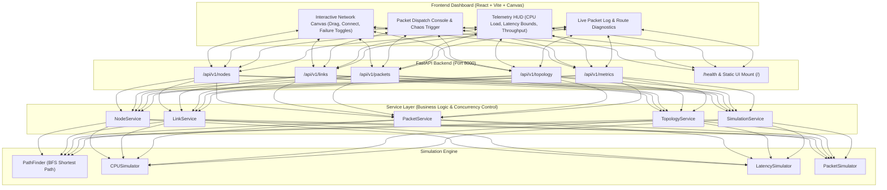

# 🌐 Network Topology Simulator & Telemetry Platform

[](https://fastapi.tiangolo.com)
[](https://react.dev/)
[](https://www.typescriptlang.org/)
[](https://www.docker.com/)
[]()
[](LICENSE)

A high-performance full-stack network simulation and telemetry platform built with **FastAPI**, **React 18**, **TypeScript**, and **Clean Architecture**. The platform allows interactive graph manipulation, real-time dynamic routing visualization with glowing packet animations, link and node failure injection (chaos engineering), telemetry metrics (CPU load & latency distribution), and automated traffic burst generators.

---

## 🏛️ System Architecture



---

## ✨ Features

- **🎨 Modern Dark Glassmorphic Web UI**:
  - **Interactive Physics Canvas**: Drag nodes, connect new links, left-click to toggle failure (cable cut/outage), right-click to delete.
  - **Live Animated Packets**: Glowing particle pulses travel along the resolved shortest path across hops in real time.
  - **Topology Presets in 1 Click**: Load *Full Mesh*, *Ring*, *Star (Hub & Spoke)*, *Hierarchical Tree*, or *Reference 5-Node* topology instantly.
  - **Chaos Mode**: Injects random link cuts or node outages to test dynamic graph rerouting and failover self-healing.
  - **Auto-Traffic Burst Mode**: Streams simulated diagnostic packets across active nodes continuously.
  - **Telemetry HUD**: Real-time per-node CPU workload meters, packet latency distribution (min/max/avg), and delivery rate counters.
  - **Drop Reason Diagnostics**: Real-time classification for dropped packets (`SOURCE_OFFLINE`, `DESTINATION_OFFLINE`, `NO_ROUTE`).

- **⚡ Robust FastAPI Backend**:
  - Full REST API with Pydantic v2 validation.
  - Concurrency-controlled, thread-safe in-memory state.
  - Structured JSON logging and custom exception handlers.
  - 54 automated pytest tests with **96% code coverage**.

- **🐳 Production Docker Deployment**:
  - Multi-stage build compiles both React frontend and FastAPI backend into a single lean container.

---

## 📂 Project Structure

```
network_simulator/
├── app/                         # FastAPI Backend Application
│   ├── api/                     # REST API Routers
│   │   ├── health.py            # Health check endpoint
│   │   ├── links.py             # Link CRUD & failure toggles
│   │   ├── metrics.py           # Telemetry & performance statistics
│   │   ├── nodes.py             # Node CRUD & failure toggles
│   │   ├── packets.py           # Packet transmission & history
│   │   └── topology.py          # Network graph discovery
│   ├── core/                    # Infrastructure (Config, Logger, Exceptions)
│   ├── models/                  # Domain entity models & enums
│   ├── schemas/                 # Pydantic validation schemas
│   ├── services/                # Business logic & repository services
│   ├── simulation/              # Pure simulation engines (BFS, CPU, Latency)
│   ├── tests/                   # 54 Pytest unit & integration tests
│   ├── dependencies.py          # Dependency injection container
│   └── main.py                  # App entry point & static UI server
├── frontend/                    # Modern React 18 + Vite Web Dashboard
│   ├── src/
│   │   ├── components/          # Canvas Graph, HUD, Logs, Modals, Presets
│   │   ├── services/api.ts      # Typed API client
│   │   ├── types/api.ts         # TypeScript API contracts
│   │   ├── index.css            # Dark glassmorphic design system
│   │   └── App.tsx              # Main dashboard application
│   ├── index.html
│   ├── package.json
│   └── vite.config.ts
├── Dockerfile                   # Full-stack multi-stage Docker build
├── docker-compose.yml           # Single-command orchestration
├── requirements.txt             # Python dependencies
└── README.md
```

---

## 🚀 Quickstart Guide

### Option 1: Docker (Fastest Single-Command Setup)

Run the entire full-stack application (Frontend + Backend) with Docker Compose:

```bash
docker compose up --build
```

- **Web Dashboard**: [http://localhost:8000](http://localhost:8000)
- **Interactive Swagger API Docs**: [http://localhost:8000/docs](http://localhost:8000/docs)

---

### Option 2: Local Development Setup

#### 1. Backend Setup

```powershell
# In project root
.\.venv\Scripts\Activate.ps1
pip install -r requirements.txt
uvicorn app.main:app --reload --port 8000
```

#### 2. Frontend Setup (in a separate terminal)

```powershell
cd frontend
npm install
npm run dev
```

Open [http://localhost:3000](http://localhost:3000) in your browser!

---

## 📡 API Reference

| Endpoint | Method | Description | Status Code |
|---|---|---|---|
| `/health` | `GET` | Service health status | `200 OK` |
| `/api/v1/nodes` | `GET`, `POST` | List nodes / Create node | `200 OK` / `201 Created` |
| `/api/v1/nodes/{id}` | `GET`, `PUT`, `DELETE` | Node inspection / update / delete | `200 OK` / `204 No Content` |
| `/api/v1/nodes/{id}/enable` | `POST` | Restore node to ONLINE | `200 OK` |
| `/api/v1/nodes/{id}/disable` | `POST` | Set node to OFFLINE | `200 OK` |
| `/api/v1/links` | `GET`, `POST` | List links / Connect nodes | `200 OK` / `201 Created` |
| `/api/v1/links/{id}/enable` | `POST` | Set link to ACTIVE | `200 OK` |
| `/api/v1/links/{id}/disable` | `POST` | Cut link (set to DOWN) | `200 OK` |
| `/api/v1/packets/send` | `POST` | Dispatch packet & calculate dynamic route | `201 Created` |
| `/api/v1/packets` | `GET` | Full packet history with routes and latency | `200 OK` |
| `/api/v1/topology` | `GET` | Complete graph topology | `200 OK` |
| `/api/v1/metrics/cpu` | `GET` | Node CPU workload telemetry | `200 OK` |
| `/api/v1/metrics/latency` | `GET` | Latency distribution (min/max/avg) | `200 OK` |
| `/api/v1/metrics/statistics` | `GET` | Global delivery rate & throughput statistics | `200 OK` |

---

## 🧪 Testing

Run all backend unit and integration tests:

```powershell
pytest app/tests/ -v --cov=app --cov-report=term-missing
```

```
======================== 54 passed in 0.54s (96% Coverage) ========================
```

---

## 📄 License

Open-source under the [MIT License](LICENSE).